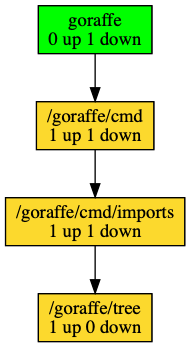

*******
Goraffe
*******

graphing with go. get it?

Description
===========

Very much a work in progress. I'm using this to learn about go tools, brush off
old graphviz skillz, and perhaps make something useful to other Go developers.

This codebase does not currently use go modules, and is meant to work only
inside a ``$GOPATH``, and run against other repos in the ``$GOPATH``.

Installation
============

.. code-block:: console

   $ go get -u github.com/spilliams/goraffe/goraffe

Usage
=====

Imports
-------

``goraffe imports`` is a command that builds a tree of package names, connected
by how they import each other. The various options and flags of imports are
described in its help function (``goraffe imports --help``), but here are some
example use cases:

.. code-block:: console

   $ goraffe imports <parent directory> <root packages> [flags]

The basic command with ``<parent directory>`` and ``<root packages>`` will
build the whole tree of everything inside the parent directory, starting from
the named roots.

.. code-block:: console

   $ goraffe imports <parent directory> <root package> --keep <other package> [--keep <other package>]--grow 2

The "keep/grow" flags will let you zero in on a specific package in the tree,
and see importers and importees N levels away (in this example, 2).

.. code-block:: console

   $ goraffe imports <parent directory> <root packages> --branch <other package> [--branch <other package>]

The "branch" flag will let you track all the import paths between the root(s)
and the named package(s).

This command is built with `cobra <https://github.com/spf13/cobra/>`__, so all
of its subcommands have a ``-h|--help`` option for displaying documentation, as
well as a ``-v|--verbose`` option for printing more output (to ``stderr``).

TODO
====

1. any kind of tests
2. optionally add a legend to the graphviz output?
3. try again on modules

spitball: scopes
----------------

1. I tried the original scope idea, which was to name every root package. it
   was wordy, and it was bad at including things it couldn't find.
2. I then (now) tried the "parent directory" scope idea, which was to name the
   parent directory, then name all the roots relative to that. It's less wordy,
   and avoids completely the external imports.
3. I foresee a future where three separate repos (all inside the GOPATH or even
   all as separate go modules) have cross-imports with each other, and someone
   will want to graph that. Think like, packages named ``product-server``,
   ``product-client``, and ``product-shared``.
4. There's also a possibility I *do* want to include ``fmt`` and ``strings``.
   Or maybe I want to see the internal structure of ``fmt`` or ``strings``.
5. I will need to handle importing externals, gracefully exclude "C", etc.

What stands in my way?

-  I'm not quite sure what go means when it talks about "vendors". Prefixing a
   package with "vendor/" seems to help some things, but I don't know why.
-  I tried including externals once already and some packages just didn't have
   **any** edges on them. Others had edges on them but still listed as 0 up,
   0 down.

call tracer
-----------

``goraffe calltree <pkg> <func>`` can we introspect on function calls within
the context of a package?

I have one or more funcs I wish to trace
I want to trace them back to roots (so the graph doesn't get so out of whack)
Thankfully, the API naturally terminates at the top-level packages
``endpoints`` etc.
For callers in a test func, I can check the filename to see the ``_test.go``
and terminate those traces at the ``test`` root?

So for something like ``log.Debugf``, which is called in the CLI and services
and other "top-level" packages, I'd like to be able to specify which roots I
care about.
Sort of a "trace the func up to the roots, then pick some of the roots to keep,
and trickle down a 'keep' flag, then trim away all the stuff that isn't 'keep'"

update: can i use something like a Language Server Protocol for getting this info?
https://langserver.org/

Methodology
-----------

I very much like the simplicity of ``dot``, but sometimes it gets...hard to
read. We'll likely want a product that hosts an HTTP service, with an API and a
front-end. The front-end will have a bunch of d3 stuff on it.

Resources to Explore
--------------------

- read that book on dataviz

- davecheney's `glyph <https://github.com/davecheney/junk/tree/master/glyph>`__

- `gddo-server <https://github.com/golang/gddo/blob/master/gddo-server/graph.go>`__
- https://github.com/kisielk/godepgraph

- https://groups.google.com/forum/#!forum/gonum-dev
- https://www.gonum.org/post/introtogonum/
- `gonum...dot <https://github.com/gonum/gonum/tree/master/graph/encoding/dot>`__

- https://github.com/sourcegraph/go-langserver or https://github.com/golang/go/wiki/gopls ?
