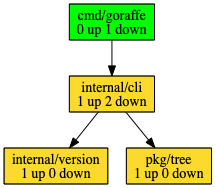

*******
Goraffe
*******

graphing with go. get it?

Description
===========

Very much a work in progress. I'm using this to learn about go tools, brush off
old graphviz skills, and perhaps make something useful to other Go developers.

This codebase is a go module itself, but does not work to inspect other modules.
It can only inspect local packages inside the ``GOPATH``.

Installation
============

.. code-block:: console

   $ go get -u github.com/spilliams/goraffe/goraffe

Usage
=====

See ``goraffe -h`` for the latest documentation.

TODO
====

problem: importing
------------------

As the tool stands now, I believe it only works when the named parent directory
is in side ``GOPATH``. I would like to make it work for, say, a module someone
is writing somewhere else in the file system. Or perhaps to look at imports of
a module that's published online but doesn't exist locally.

Not sure where to go from here. Have the tool call ``go get`` then ``chdir``
and ``go list``? The internal code for ``go list`` is pretty interesting but
unfortunately it's not allowed to import that into my tool.

call tracer
-----------

``goraffe calltree <pkg> <func>`` can we introspect on function calls within
the context of a package?

For instance: I have a go module that represents a web API. It has user-facing
funcs (endpoints tied to a router), and I want to see who calls a low-level db
func.

Can I use something like a Language Server Protocol for getting this info?
https://langserver.org/
https://github.com/sourcegraph/go-langserver or https://github.com/golang/go/wiki/gopls ?

Methodology
-----------

I very much like the simplicity of ``dot``, but sometimes it gets...hard to
read. We'll likely want a product that hosts an HTTP service, with an API and a
front-end. The front-end will have a bunch of d3 stuff on it?

Resources to Explore
--------------------

- davecheney's `glyph <https://github.com/davecheney/junk/tree/master/glyph>`__

- `gddo-server <https://github.com/golang/gddo/blob/master/gddo-server/graph.go>`__
- https://github.com/kisielk/godepgraph

- https://groups.google.com/forum/#!forum/gonum-dev
- https://www.gonum.org/post/introtogonum/
- `gonum...dot <https://github.com/gonum/gonum/tree/master/graph/encoding/dot>`__
